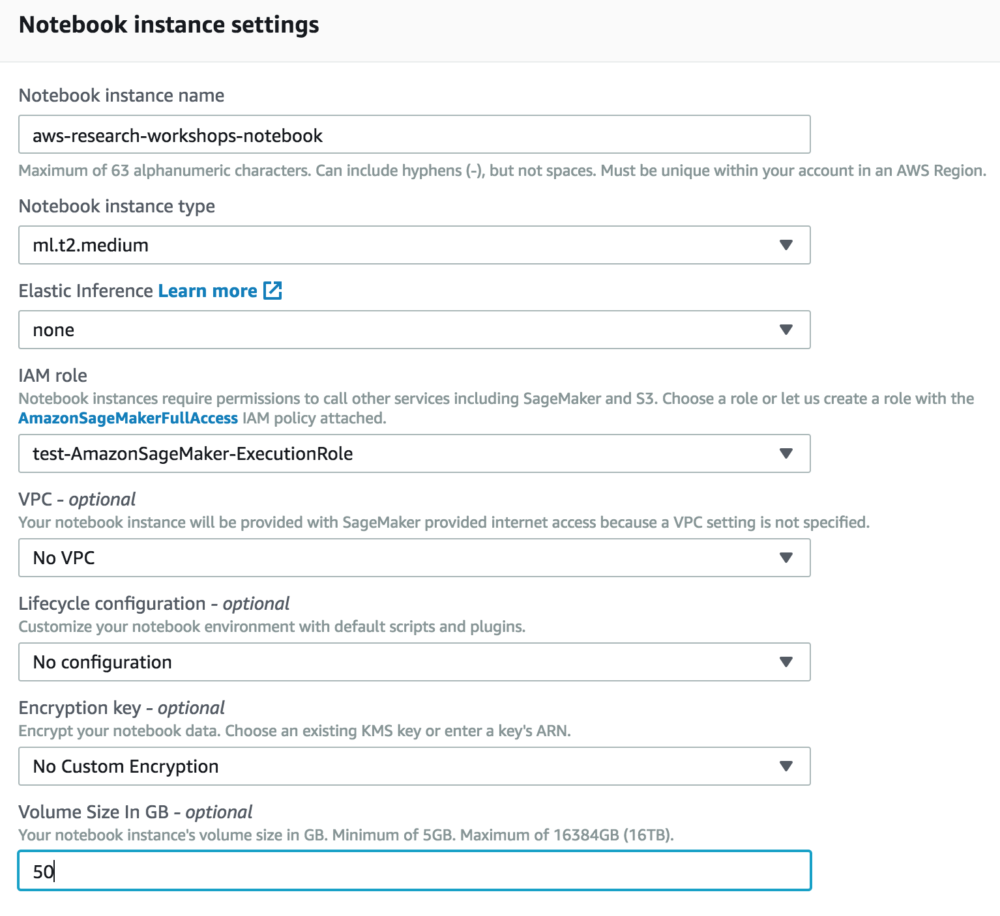
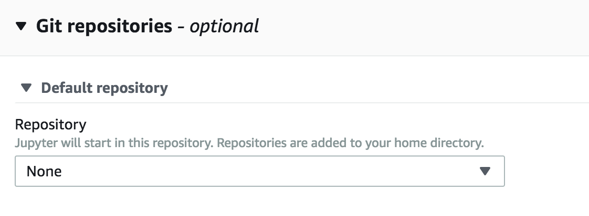

## AWS Research Workshops

This repo provides a managed SageMaker jupyter notebook with a number of notebooks for hands on workshops in data lakes, AI/ML, Batch, IoT, and Genomics. 

## Workshops

> Please review and complete all prerequisites before attempting these workshops.

Title               | Description
:---: | :---
[Introduction to AWS Basics](./notebooks/intro_to_aws/)                           | Learn about core AWS services for compute, storage, database and networking. This workshop has a hands-on lab where you will be able to launch an auto-scaled Apache web server behind an ALB, S3 bucket hosting content of the home page, and how to define the approriate roles for each resource.
[Buidling a Data Lake for Analytics and Machine Learning](./notebooks/building_data_lakes/) | In this hands-on workshop, you will learn how to understand what data you have, how to drive insights, and how to make predictions using purpose-built AWS services. Learn about the common pitfalls of building data lakes, and discover how to successfully drive analytics and insights from your data. Also learn how services such as Amazon S3, AWS Glue, Amazon Athena, and Amazon AI/ML services work together to build a serverless data lake for various roles, including data scientists and business users.
[Build, Train, and Deploy ML Models at scale with Amazon SagaeMaker](./notebooks/ml_sagemaker/) **Coming Soon**| This workshop shows how you can use machine learning algorithms with Amazon SageMaker leveraging built-in algorithms, bringing your own, and hosting inference endpoints for prediction. You'll learn how to load the notebook in SageMaker, train the model, and deploy endpoints for prediction activity.
[Build Serverless Applications in Python with AWS SAM CLI](./notebooks/serverless_apps/) **Coming Soon** | AWS Serverless Applications in Python: With AWS Serverless computing you can run applications and services without having to provision, scale, and manage any servers. In this workshop, we will introduce the basics of building serverless applications and microservices using services like AWS Lambda, Amazon API Gateway, Amazon DynamoDB, and Amazon S3. You’ll learn to build and deploy your own serverless application using these services for common use cases like web applications, analytics, and more.
[Tensorflow with Amazon SageMaker](./notebooks/ml_tensorflow/) | Amazon SageMaker is a fully- managed platform that enables developers and data scientists to quickly and easily build, train, and deploy machine learning models at any scale. Amazon SageMaker removes all the barriers that typically slow down developers who want to use machine learning. We will show you how to train and build a ML model on SageMaker then how to deploy the inference end points on tools like AWS Greengrass or Serverless applications.
[Introduction to IoT Greengrass](./notebooks/iot_greengrass/) | AWS IoT services enable you to easily and securely connect and manage billions of devices. You can gather data from, run sophisticated analytics on, and take actions in real-time on your diverse fleet of IoT devices from edge to the cloud. AWS Greengrass is software that lets you run local compute, messaging, data caching, sync, and ML inference capabilities for connected devices in a secure way.
[Cost-effective Research leveraging AWS Spot](./notebooks/spot/) **Coming Soon**| With Amazon Web Services (AWS), you can spin up EC2 compute capacity on demand with no upfront commitments. You can do this even more cost effectively by using Amazon EC2 Spot Instances to bid on spare Amazon EC2 computing capacity. This allows users to get 90% off on demand prices (often as little as 1c per core hour) and has helped them run very large scale workloads cost effectively. For example, at USC a computational chemist spun up 156,000 core in three days. Also, with the recent release of the Spot fleet API, a researcher or scientist can easily have access to some of the most cost effective compute capacity at a very large scale. Learn how to effectively use these tools for your research needs.
[Build a Genomics Pipeline on AWS with Cromwell and AWS Batch](./notebooks/genomics_pipeline/) | Deriving insights from data is foundational to nearly every organization, and many researches process high volumes of data every day. One common requirement of customers in life sciences is the need to analyze these data in a high-throughput fashion without sacrificing time-to-insight. Such analyses, which tend to be composed of a series of massively parallel processes (MPP) are well suited to the AWS Cloud. In this session, we will introduce you to AWS and then show you how to set up genomics workflows on AWS. We will also show to users how to optimize Amazon EC2 Spot Instances use and save up to 90% off of traditional On-Demand prices. Note: this approach to batch processing can be generalized to any type of batch workflow so anyone is welcome to attend.

## Prerequisites

### AWS Account

In order to complete these workshops you'll need a valid, usable AWS Account with Admin permissions.  The code and instructions in these workshops assume only one student is using a given AWS account at a time. If you try sharing an account with another student, you'll run into naming conflicts for certain resources. 

Use a **personal account** or create a new AWS account to ensure you have the neccessary access. This should not be an AWS account from the company you work for.

If you are doing this workshop as part of an AWS sponsored event, you will receive credits to cover the costs.

### Browser

We recommend you use the latest version of Chrome or Firefox to complete this workshop.

### Text Editor

For any workshop module that requires use of the AWS Command Line Interface (see above), you also will need a **plain text** editor for writing scripts. Any editor that inserts Windows or other special characters potentially will cause scripts to fail.

## Launching Research Notebook Instance

SageMaker provides hosted Jupyter notebooks that require no setup, so you can begin processing your training data sets immediately. With a few clicks in the SageMaker console, you can create a fully managed notebook instance, pre-loaded with useful libraries for machine learning.

1. In the upper-right corner of the AWS Management Console, confirm you are in the desired AWS region. Select a Region with SageMaker support.

2. From the Services drop-down menu type `SageMaker` to filter the list of all services.  This will bring you to the Amazon CloudFormation console homepage.

3. To Cloud **Notebook instances**, and click the **Create notebook instance** button at the top of the browser window.

4. Type `aws-research-workshops-notebook` into the **Notebook instance name** text box, and select ml.t2.medium for the **Notebook instance type**.

5. For IAM role, choose **Create a new role**, (steps to come) will require sagemaker and glue trust permission and `AdministratorAccess` policy for access required services.

6. In the Git Repositories section clone this repo to be included in the notebook instance.

7. Click **Create notebook instance**.

#### 3. Accessing the Notebook Instance

1. Wait for the server status to change to **InService**. This will take several minutes but likely less.

2. Click **Open**. You will now see the Jupyter homepage for your notebook instance.

## License Summary

This sample code is made available under a modified MIT license. See the [LICENSE](LICENSE) file.
